## 10.2 Lesson Plan - 'Nother Level of Node (6:30 PM) <!--links--> &nbsp; [⬅️](../01-Day/01-Day-LessonPlan.md) &nbsp; [➡️](../03-Day/03-Day-LessonPlan.md)

### Overview

In this class, we will be building on students' proficiency with Node by introducing them to the fs package for reading and writing files along with the external NPM axios package for performing HTTP get requests.

`Overview: Complete activities 10-19 in Unit 10`

##### Instructor Priorities

* Students should know how to use the Node internal `fs` package to read, write, and append files.
* Students should know how to use the external NPM package `axios` to perform GET requests on webpages.

##### Instructor Notes

* Today's class is a fairly gentle intro that is very activity focused. Just be mindful of your timing and it should be a fairly smooth class.

* Be warned that the "hard" activity of the day is the Bank.JS activity. This may take some students more time, so play it by ear if additional time is needed. Make sure to leave time to cover Node requests, however, as the knowledge contained within that lesson is crucial to completing the homework this week.

* Have your TAs reference [02-Day-TimeTracker](02-Day-TimeTracker.xlsx) to help keep track of time during class.

### Sample Class Video (Highly Recommended)
* To view an example class lecture visit (Note video may not reflect latest lesson plan): [Class Video](https://codingbootcamp.hosted.panopto.com/Panopto/Pages/Viewer.aspx?id=3a6ab36f-a08d-42e8-9388-aef124c28f5f)

- - -

### Class Objectives

* To introduce the internal `fs` package for handling reading and writing to files with Node.
* To introduce the NPM `axios` package for performing HTTP get requests to external websites with Node.

- - -

### 0. Instructor Do: Welcome Students (1 mins)

* Spend a minute to welcome students back to class before jumping straight into the first activity.

### 1.	Students Do: Command Line Equality	(10 mins)

* Slack out the following:

* **Instructions:**

  * Starting from a blank JavaScript file, create a Node application that takes in two command line arguments and checks if they are equal. If the two numbers are equal then output: "true". Otherwise output: "false".

  * Bonus: Check if the two numbers are both multiples of 7. Again output "true" if they are and output "false" if they are not.

  * Hint: `console.log(process.argv)` as a starting point if you are completely lost.

### 2.	Instructor Do: Review Command Line Equality	(7 mins)

* Open the file `solution1.js` (`10-CommandLineArg`) and walk students through the solution. Use the comments to guide the conversation.

    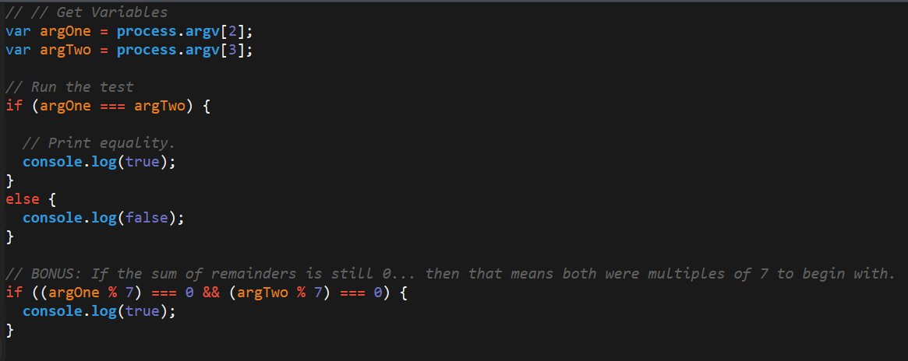

* Then open the file `solution2.js` (`10-CommandLineArg`) and walk students through the re-factored (minified/simplified) solution. Again use the comments to guide the conversation.

    

* In discussing the solution, be sure to point out that "re-factored solutions" oftentimes only become apparent after creating the more manual way first.

* Check if there are any questions. Then slack out the solution and proceed to the next section.

### 3. Instructor Do: Write a File	(15 mins)

* Open the file `write.js` (`11-WriteFile`). In this example, you will be introducing students to the concept of writing to a text file using Node's internal `fs` package.

* As an internal Node package, `fs` does not require you to install anything prior to running.

* Use the comments in the code to guide the conversation.

* Then run the program using `node write.js`.

* Point out that if the file did not exist, then the command `writeFile` would create one for us with the expected text contained within it.

    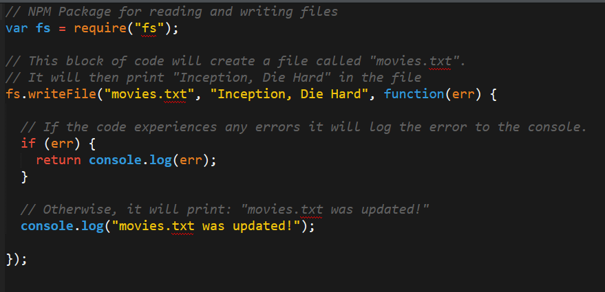

    

* Give students a second to digest the code before slacking it out to them.

### 4	Everyone Do: Guess readFile	(1 mins)

* Have students answer the following question:

  * "If the Node method for writing files is writeFile, what do you think the Node method for reading files would be?" (Answer: readFile)

### 5.	Instructor Do: Read a File	(10 mins)

* Proceed to the next activity and open the folder `12-ReadFile`.

* Point out how this folder has both a `read.js` file and a `movies.txt` file contained within it.

* Then open the `read.js` code, and use the comments to guide the conversation. Be sure to point out how `readFile` returns three parameters (`err`, `response`, `data`).

    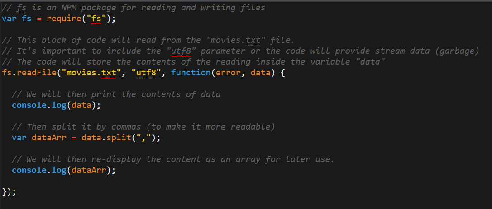

    

* Students may be confused where these variables are coming from, so this might be a good time to explain that `readFile` is effectively "making" the values and assigning these variables via a callback. DON'T GO TOO IN DEPTH ABOUT CALLBACKS. We'll cover those in more depth next week.

* Run the code using `node read.js`. Point out how the contents of the file were all console logged.

* You can additionally change the contents of the `movies.txt` file and re-run to show that the new contents were read as well.

### 6.	Instructor Do: Show FS Docs + Stack Overflow	(7 mins)

* At this point, it's a good time to discuss with students the process of how we "discover" methods like readFile and writeFile.

* First, go to the Node documentation and visit the `fs` documentation: <https://nodejs.org/api/fs.html>. Feel free to slack this link to your students as well.

* Scroll through the documentation and point out the list of methods `fs` provides us. Specifically search for and show the documentation for `fs.readFile`. Explain how that documentation can quickly explain how to use methods as necessary.

    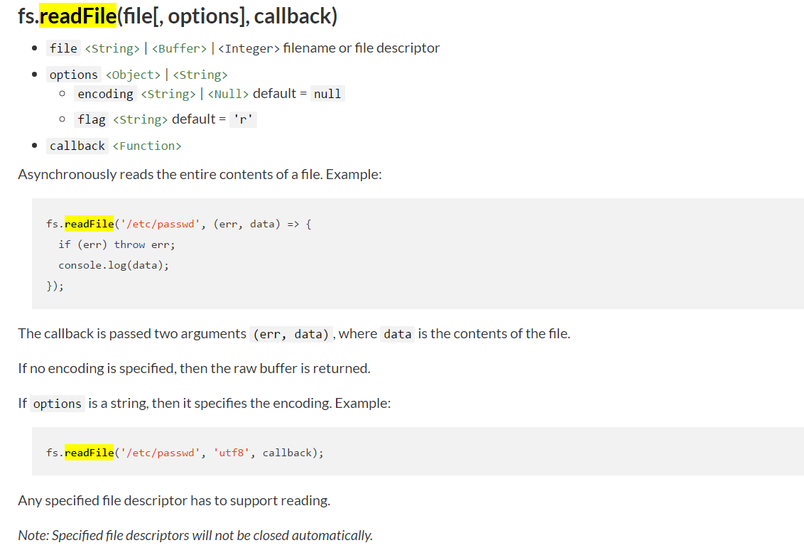

* Then explain that, while documentation can be the most comprehensive source of information on libraries, sometimes it's easier just to search in Google a term like: "How to read files in Node".

* Point out how the first website is not the Node documentation but a tutorial website that more easily shows the method implemented.

    

* Be sure to tell students that there is no shame in going to Google first as new developers. Many might wrongfully think this is "just copying and pasting" and not true coding. (Hah! Copying and pasting IS true coding!)

### 7.	Groups Do: Best Things Ever (15 mins)

* Continue on to the next student activity.

* Then slack out the following instructions and files:

* **File:**

  * `best_things_ever.txt` (`13-BestThingsEver`)

* **Instructions:**

  * Create a Node application that reads the `best_things_ever.txt` file, parses the comma separated elements, and ultimately console logs each element in the file on separate lines.

    * HINT: If you are struggling to figure out how to loop your way through the text, look into the `.split()` method. This could make your life a whole lot easier.

  * Your final output should look something like this:

  ```
  lazy boy recliner
    massage
    meditation
    hot shower
    cheese fondue
    hot coffee with cashew milk
    kitten falling asleep on my lap
  ```

### 8.	Instructor Do: Review Best Things Ever	(10 mins)

* Review the activity using the solved file `readBest.js` and use the comments as a guide.

* Be sure to point out how we use `data.split(',')` to separate the elements by commas. Explain that `.split` breaks the elements and stores the contents into an array. We then loop through this generated array and `console.log` each element one element at a time.

    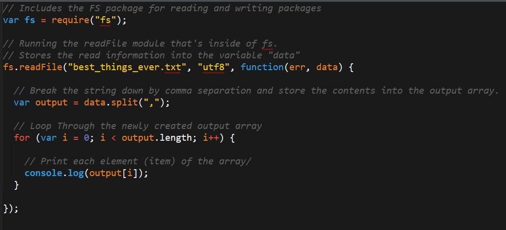

- - -

### 9.	Break	(15 mins)

- - -

### 10.	Instructor Do: AppendFile	(7 mins)

* Continue onto the next example by first pointing out how up until now we've been using `writeFile` to write to text files. Explain that `writeFile` simply erases the contents of the file before writing the replacement content. This is not exactly ideal in most situations since, more often than not, we do not want to delete data like that.

* Explain that if we would like to keep the original content and add to it then we will need to instead use the `appendFile` method.

* Open the file `appendFile.js` (`14-AppendFile`).

* Ask a student in class to explain the code to everyone using the comments as a guide.

* Point out how `appendFile` works effectively the same as `writeFile`. In fact, it will also create a new file if one does not already exist. Unlike `writeFile`, however, `appendFile` won't clear the contents of a file if that file already exists.

    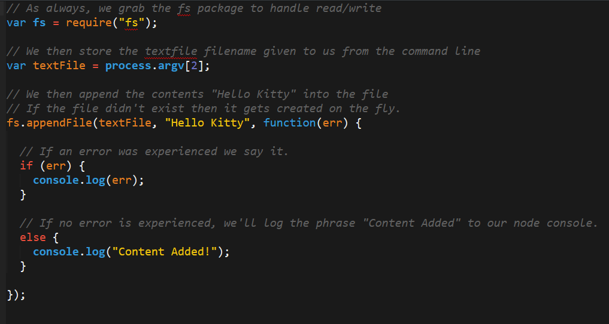

* Run the application using `node appendFile.js kitty.txt` a few times to demonstrate this.

* Ask if there are any questions. Then slack out the solution.

### 11.	Groups Do: Bank.js	(30 mins)

* Navigate to the folder `15-BankJS > Solved` and run each of the following commands for your students to see.

  * `node bank.js total` (this will output the total in the bank)

  * `node bank.js deposit <number>` (this will deposit a value of <number> in the bank)

  * Again `node bank.js total` (this will show that the total has changed)

  * `node bank.js withdraw <number>` (this will withdraw a value of <number> from the bank)

  * Again `node bank.js total` (this will show the total has changed)

  * Finally `node bank.js lotto` (this will buy a lotto ticket that can either lose you 25 cents or gain you $2)

* The screenshots below show you what the output will roughly look like.

    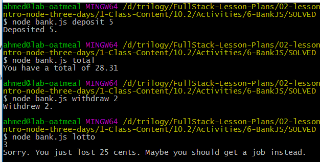

* Then open the file `bank.txt` and show how this text file has been "tracking" all of the deposits, withdrawals, and lotto purchases, and that total tallies it up to return the output.

    

* Let students know that this is what they will be building over the next 25 minutes.

* Slack out the following file and instructions.

* **File:**

  * `bank.txt` (`15-BankJS > UNSOLVED`)

* **Instructions:**

  * Starting from scratch, build a Node application called `bank.js` which allows takes in user inputs via the command line to register bank transactions.

  * The transactions possible are:

    * `total` - this should tally up all of the money in the bank balance and display it for the user.

    * `deposit <number>` - this should add a positive amount to the bank balance. (No need to display the total here)

    * `withdraw <number>` - this should add a negative amount to the bank balance. (No need to display the total here)

    * `lotto` - this should subtract an amount from the bank balance, but if a random number is hit it should add back a larger amount into the bank balance.

  * For all deposits, withdrawals, or lotto purchases the transaction should be registered in the `bank.txt` file.

  * HINT: Consider making a series of if-else or switch-case statements to identify the "type" of transaction and the "amount" involved (if relevant).

  * Bonus: If you finish early, consider finding creative ways to expand the functionality. Perhaps add a login, perhaps always provide the total, perhaps add a warning if the user tries to withdraw more than they hold, etc.

### 12.	Instructor Do: Review Bank.js	(7 mins)

* Slack out the code and provide students a few moments to look over the code before explaining it to them.

* Use the comments as a guide to explain how we:

  * Capture the "transaction type" and "value" via `process.argv[2]` and `process.argv[3]`.

  * Use if-else or switch-case to route the user to specific functions relevant to the given transaction type.

    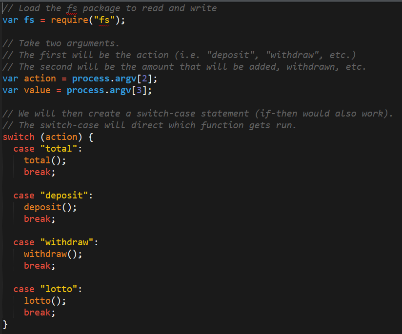

  * If the transaction type is `total` then we will use `readFile` read the contents of `bank.txt` and combine the numbers

    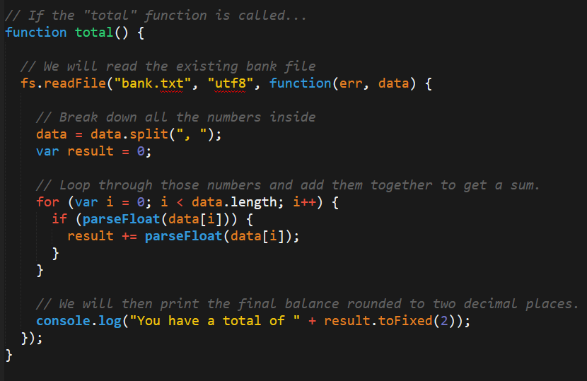
    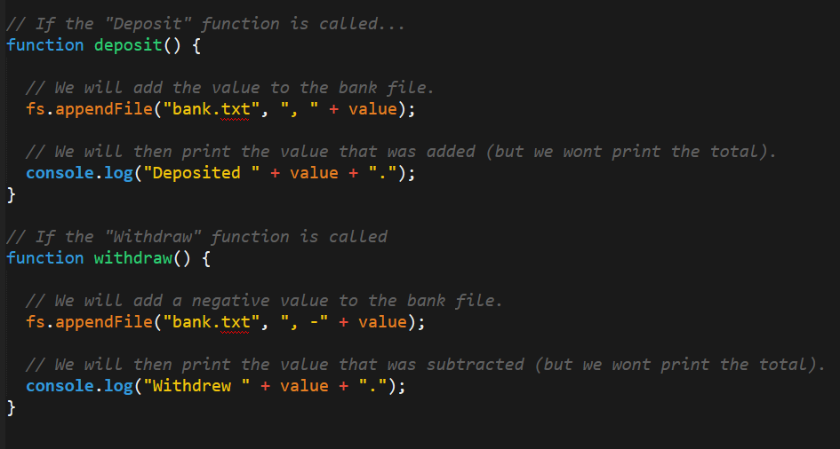

  * If the transaction type is `deposit`, `withdraw`, or `lotto` we will instead use `appendFile` to add a numeric value to the textfile.

* See if there are any questions before slacking out the solutions to students.

### 13.	Instructor Do: AxiosJS	(0:10)

* Proceed to the next example, which will introduce students to the use of the NPM `axios` package.

* Open the file [axios.js](../../../../01-Class-Content/10-nodejs/01-Activities/16-Axios/1-MissingPackage).

* Don't get too deep initially. Just explain that this code is intended to do a GET request to the wikipedia article on Kudos Bars and will grab the HTML body from it.

    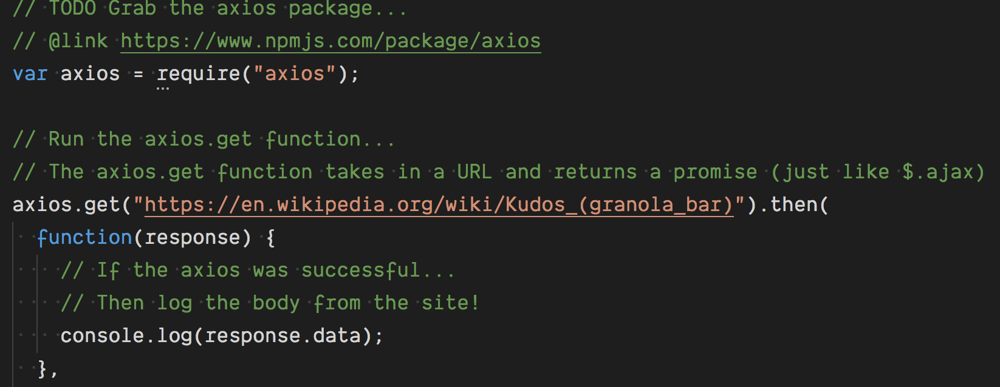

* Try to run the file using `node axios.js`, but point out that an error is experienced.

  

* Ask students if they have any ideas as to what is causing the error before explaining that the issue is due to the fact that the `axios` package is an external NPM package and thus requires us to install it in order to function.

* Ask students if they have any ideas on how to install the package. They most likely will not know how to do this at the moment, but the answer is to run `npm install axios` inside the axios.js folder in Git Bash or terminal.

* Proceed to install the `axios` package and then re-run the code to show that it works this time.

  

* At this point, do a deep dive of the code. Be sure to explain the three arguments (`error`, `response`, and `body`) which are returned by the request function. Be certain to explain the differences between the `response` and the `body` arguments in particular.

* Ask if there are any questions, then slack out the solution to students.

### 14.	Instructor Do: OMDB-Axios	(0:07)

* Proceed with the next example, which will use the `axios` package once again. This time, instead of grabbing random HTML content, we will use it to grab specific information from the OMDB API (the API for IMDB).

* Open the file [omdbAxios.js](../../../../01-Class-Content/10-nodejs/01-Activities/17-OMDB_Axios).

* Give students a few moments to look at the code before diving into the explanation or having them explain it to the class if you feel like there are some confident individuals out there.

* Proceed to point out how, like the last file, we use the `axios` package to get data from a website. This time, however, the website is actually an API that provides JSON content.

* Point out how we are thus able to use the `response` and specifically the `response.data.imdbRating` to specifically grab the IMDB rating for our movie of interest (in this case "Remember the Titans").

    

* Ask if there are any questions, before slacking out this solution.

### 15.	Partners Do: OMDB-Axios Interactive	(0:20)

* Finally provide the last exercise of the day.

* Slack out the following file and instructions:

* **File:**

  * [omdbInteractiveStarter.js](../../../../01-Class-Content/10-nodejs/01-Activities/18-OMDB_Axios_Students/Unsolved/omdbInteractiveStarter.js)

* **Instructions**

  * Using the code sent to you earlier as a reference and using the code provided to you as a starter, create a Node application which takes in a movie name as a command line argument then uses the OMDB API to retrieve and return the release date to the console.

  * For this activity you have two options:

    * Easier: Require that the user provide a movie with a single word in the title (ex: Cinderella)

    * Harder: Allow the user to provide a movie with as many words as possible (ex: Forrest Gump).

  * Hint: Start by figuring out what your API URL should be then use the starter code as a guide.

  * Hint: Remember to `npm install axios` or else your code will not work no matter what.

  * Hint: Be sure to use an OMDB API Key with your axios request. You may use `trilogy`.

### 16.	Instructor Do: Review OMDB-Axios Interactive	(0:07)

* Open the solution files (First `LevelOne` and then `LevelTwo`).

* Walk students through the solutions using the comments as a guide.

* Be sure to point out how we dynamically generated the queryURL and how we used the `JSON.parse(body)["Year"]` to grab the release year.

  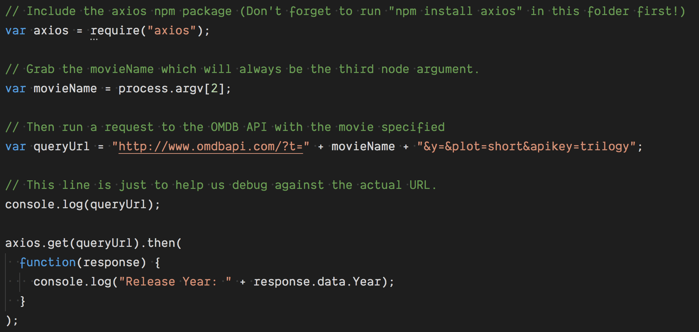

* In discussing the Challenge, you can leave it to students to decipher the "for-loop magic". Effectively, we just append a "+" for all words except the last one in the title.

  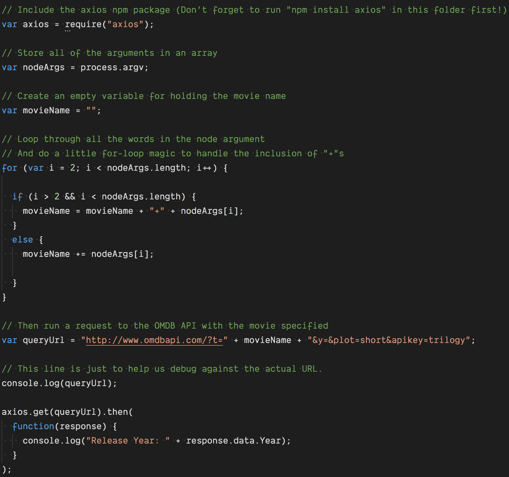

- - -

### END

- - -

### 16.	BONUS: Discuss Sync vs Async Reading	(0:15)

* If you have time and think you can cover this topic, one additional instructional opportunity is included.

* If you explore the folder `19-SyncVAsync` there are two files (`asyncAppend.js` and `syncAppend.js`) that look nearly identical. However, they differ in one significant way. One uses `appendFileSync` and the other uses `appendFile`. If you run each of these applications, you will find that the order by which the variable `secondNumber` prints is reversed.

  * `syncAppend` displays the `secondNumber` AFTER the append function prints `SAVED`
  * `asyncAppend` displays the `secondNumber` BEFORE the append function prints `SAVED`.

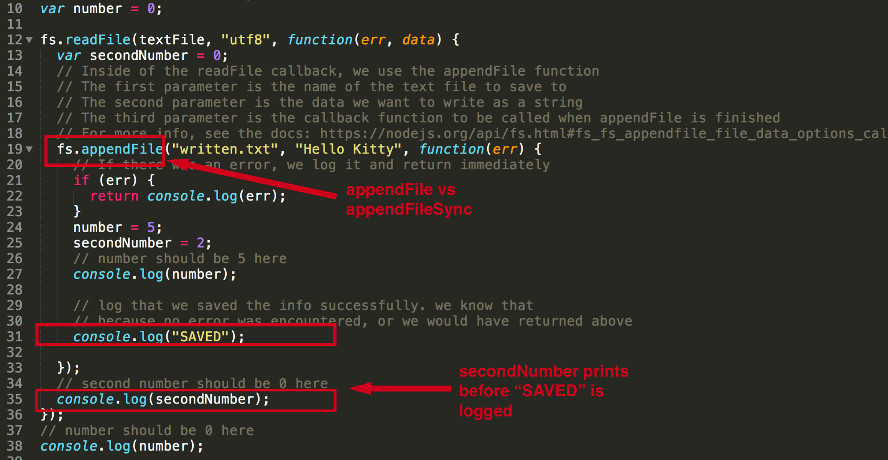

* This presents a good opportunity to introduce students to the concept of synchronous and asynchronous threading. You can also explain that effectively in asynchronous fashion, all of the "indented blocks" are their own stream. They operate independently of the other streams of code.

* Don't expect everyone to follow this, but slack the code out anyway. Your advanced students will benefit.

### Lesson Plan Feedback

How did today's class go?

[Went Well](http://www.surveygizmo.com/s3/4325914/FS-Curriculum-Feedback?format=pt&sentiment=positive&lesson=10.02)

[Went Poorly](http://www.surveygizmo.com/s3/4325914/FS-Curriculum-Feedback?format=pt&sentiment=negative&lesson=10.02)
